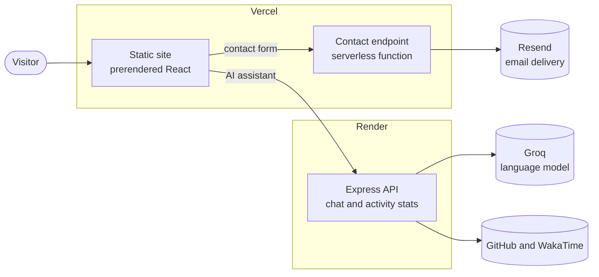

<div align="center">

<a href="https://benjaminbaya.com">
  
</a>

# benjaminbaya.com

**The personal site of Benjamin Baya, Software Engineer & Business Technology Consultant.**
<br />
I help businesses build, automate and grow with technology.

[**Visit the site**](https://benjaminbaya.com) &nbsp;·&nbsp; [Case studies](https://benjaminbaya.com/#work) &nbsp;·&nbsp; [Book a consultation](https://www.teevexa.com/book-consultation)


</div>

---

## Overview

This repository contains the website at [benjaminbaya.com](https://benjaminbaya.com) and the small API behind its AI assistant.

The site is written for business owners rather than other developers. It explains what I do in terms of outcomes, follows the journey a client actually takes (**Consult → Build → Automate → Grow**) and backs it up with case studies of real client and product work.

It is also built to the standard I would deliver for a client: fast, accessible, search-optimised and easy to maintain.

## Highlights

| | |
|---|---|
| **Prerendered pages** | Every public route is rendered to static HTML at build time, so search engines and social previews get real content, not an empty app shell. |
| **Search-ready** | Per-page titles, descriptions, canonical URLs, Open Graph and Twitter tags, JSON-LD structured data, a generated sitemap and robots.txt, and real 404 responses. |
| **Lightweight** | About 100 KB of JavaScript (gzipped) on first load. Responsive WebP images, one self-hosted variable font, and no animation library. |
| **Case studies** | Each project has its own page: the problem, the solution, my role, the technology and the outcome, with no invented metrics. |
| **AI assistant** | A chat assistant grounded in a curated knowledge base, with a built-in fallback so it keeps answering if the AI provider is unavailable. |
| **Contact form** | Sends enquiries, including attachments, through a serverless function. Spam-protected and validated on the server. |
| **Accessible** | Semantic HTML, keyboard navigation, a skip link, visible focus states, reduced-motion support, and light and dark themes. |
| **Content as data** | All copy lives in a handful of data files, so updating the site never means editing components. |

## Architecture



The site itself is fully static. The two dynamic features (the contact form and the AI assistant) are isolated behind their own endpoints, so the pages stay fast and keep working even if either service is down.

## Tech stack

| Layer | Technology |
|---|---|
| **Frontend** | React 19, React Router 7, Vite 6, Tailwind CSS 3, Lucide icons |
| **Rendering** | Custom static prerendering (`react-dom/server` + a build script) |
| **Contact** | Vercel Function + Resend |
| **API** | Node.js, Express 5, Groq (OpenAI-compatible chat API), rate limiting, in-memory caching |
| **Tooling** | npm workspaces, Turborepo, ESLint |
| **Hosting** | Vercel (site and contact function), Render (API) |

## Project structure

```
.
├── apps/
│   ├── web/                      # The website
│   │   ├── api/contact.mjs       # Contact form endpoint (Vercel Function)
│   │   ├── public/               # Images, fonts, icons, OG image
│   │   ├── scripts/prerender.mjs # Renders routes to HTML, writes sitemap + robots.txt
│   │   └── src/
│   │       ├── components/       # home/ · layout/ · ui/ · work/ · Chatbot · CommandPalette
│   │       ├── data/             # All site content (see below)
│   │       ├── pages/            # Home · CaseStudy · Resume · Activity · NotFound
│   │       ├── seo.js            # Per-route metadata and structured data
│   │       └── entry-server.jsx  # Build-time renderer
│   └── api/                      # AI assistant + activity stats API
│       ├── server.js
│       └── knowledgeBase.js      # What the assistant knows
├── packages/tsconfig/            # Shared TypeScript config
└── turbo.json
```

## Getting started

**Requirements:** Node.js 18 or later, npm 9 or later.

```bash
# 1. Clone and install
git clone https://github.com/b3njaminbaya/Benjamin-Baya.git
cd Benjamin-Baya
npm install

# 2. Create local environment files
cp apps/web/.env.example apps/web/.env
cp apps/api/.env.example apps/api/.env

# 3. Run the website and the API together
npm run dev
```

| App | URL |
|---|---|
| Website | http://localhost:3000 |
| API | http://localhost:5001 |

The site runs without any API keys. The AI assistant falls back to built-in answers, and the contact form falls back to a text-only delivery service.

### Scripts

| Command | What it does |
|---|---|
| `npm run dev` | Runs the website and the API together |
| `npm run dev:web` | Runs only the website |
| `npm run dev:api` | Runs only the API |
| `npm run build` | Production build, including prerendering, sitemap and robots.txt |
| `npm run preview --workspace=apps/web` | Serves the production build locally |
| `npm run lint` | Lints the codebase |

## Editing content

All content lives in data files. Change the data and the pages, navigation, sitemap and structured data update with it.

| File | What it holds |
|---|---|
| [`apps/web/src/data/site.js`](apps/web/src/data/site.js) | Name, title, contact details, booking link, social links, site URL |
| [`apps/web/src/data/services.js`](apps/web/src/data/services.js) | The four service pillars, client problems, process, consulting and growth areas |
| [`apps/web/src/data/caseStudies.js`](apps/web/src/data/caseStudies.js) | Case studies. Adding an entry creates its page and sitemap entry automatically |
| [`apps/web/src/data/profile.js`](apps/web/src/data/profile.js) | Experience timeline, tech stack, education, certifications |
| [`apps/web/src/seo.js`](apps/web/src/seo.js) | Page titles, descriptions and structured data |
| [`apps/api/knowledgeBase.js`](apps/api/knowledgeBase.js) | What the AI assistant knows. Keep it in step with the site. |

## Environment variables

None are required for local development.

### Website: `apps/web/.env`

| Variable | Purpose |
|---|---|
| `VITE_API_URL` | Address of the API. Defaults to the production API. |
| `VITE_SITE_URL` | Public site address used for canonical URLs and the sitemap. Defaults to `https://benjaminbaya.com`. |
| `RESEND_API_KEY` | Enables the contact form endpoint. Server-side only. |
| `CONTACT_FROM` | Verified sender address for enquiry emails. |
| `CONTACT_TO` | Inbox that receives enquiries. |

### API: `apps/api/.env`

| Variable | Purpose |
|---|---|
| `GROQ_API_KEY` | Enables AI answers. Without it the assistant uses built-in answers. |
| `GROQ_MODEL` | Chat model to use. Optional. |
| `GITHUB_TOKEN` | Read-only token for the activity page. |
| `WAKATIME_API_KEY` | Coding-activity stats for the activity page. |
| `FRONTEND_URL` | An additional site address allowed to call the API. |
| `PORT` | Port to listen on. Defaults to `5001`. |

Variables without the `VITE_` prefix are never included in the browser bundle.

## Deployment

Both apps deploy automatically when `main` is updated.

| App | Platform | Notes |
|---|---|---|
| `apps/web` | Vercel | Root directory `apps/web`. Builds the site, prerenders every route, and deploys the contact function. |
| `apps/api` | Render | Root directory `apps/api`. Start command `node server.js`. |

`www.benjaminbaya.com` and the original Vercel address redirect permanently to `https://benjaminbaya.com`.

## Contact

**Benjamin Baya**, Software Engineer & Business Technology Consultant, Nairobi, Kenya

| | |
|---|---|
| **Email** | b3njaminbaya@gmail.com |
| **Phone / WhatsApp** | +254 794 126 508 |
| **Website** | [benjaminbaya.com](https://benjaminbaya.com) |
| **LinkedIn** | [linkedin.com/in/b3njaminbaya](https://linkedin.com/in/b3njaminbaya) |
| **GitHub** | [github.com/b3njaminbaya](https://github.com/b3njaminbaya) |
| **Consultation** | [teevexa.com/book-consultation](https://www.teevexa.com/book-consultation) |

## License

Copyright © 2025–2026 Benjamin Mweri Baya. All rights reserved.

This repository is public so the code can be read and evaluated. It is not open source: the code, design, written content and images may not be copied, reused or redistributed without written permission. See [LICENSE](./LICENSE) for the full terms, and email b3njaminbaya@gmail.com if you would like to use any part of it.
